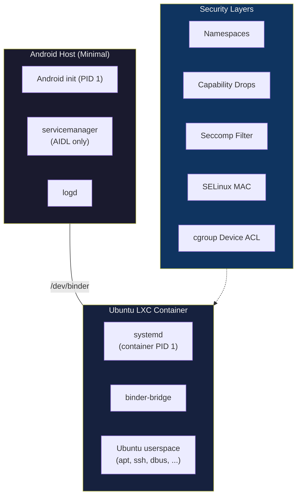

# Ubuntu GSI — Treble-Compliant Android with Ubuntu LXC Container

A minimal Android Generic System Image (GSI) that boots Ubuntu Linux inside an LXC container on arm64 A/B dynamic partition devices, using binder-only AIDL IPC with strong security isolation.

---

## Architecture



### Key Properties

| Property | Value |
|----------|-------|
| IPC | Binder-only (no hwbinder, no HIDL) |
| HALs | Stable AIDL only, lazy & optional |
| Host PID 1 | Android init (minimal stub) |
| Container PID 1 | systemd |
| Ubuntu rootfs | `/data/ubuntu` (OverlayFS) |
| System partition | Read-only, ~50-80 MB |
| Vendor partition | Untouched, never mounted in container |
| Target devices | arm64, A/B, dynamic partitions |

---

## Repository Structure

```
Ubuntu_GSI/
├── system/                              # System partition contents
│   ├── etc/
│   │   ├── init/ubuntu-gsi.rc          # Minimal Android init config
│   │   ├── lxc/ubuntu/config           # LXC container configuration
│   │   ├── selinux/ubuntu_gsi.cil      # SELinux policy (CIL)
│   │   └── seccomp/ubuntu_container.json  # Seccomp syscall filter
│   └── build.prop                       # Build properties
├── scripts/
│   └── setup-ubuntu.sh                  # Ubuntu rootfs bootstrap
└── docs/
    ├── boot_flow.md                     # Boot sequence documentation
    ├── threat_model.md                  # Security threat analysis
    ├── selinux_policy.md                # SELinux policy outline
    └── system_layout.md                 # Directory layout details
```

---

## Quick Start

### Prerequisites
- arm64 device with Treble support + A/B + dynamic partitions
- Unlocked bootloader
- ADB and fastboot installed
- Kernel with: `CONFIG_ANDROID_BINDERFS`, `CONFIG_NAMESPACES`, `CONFIG_OVERLAY_FS`, `CONFIG_SECCOMP_FILTER`, `CONFIG_VETH`

### Steps

```bash
# 1. Flash GSI system image
fastboot flash system ubuntu-gsi-arm64.img

# 2. Boot the device
fastboot reboot

# 3. Wait for Android init to start (device will NOT show Android UI)
# 4. Connect via ADB
adb shell

# 5. Run Ubuntu bootstrap (first boot only)
sh /system/scripts/setup-ubuntu.sh

# 6. The LXC container auto-starts on next boot
# 7. Attach to Ubuntu
lxc-attach -n ubuntu -- /bin/bash

# 8. Inside Ubuntu — use apt normally
apt update && apt install openssh-server
```

---

## Security Model

Five independent security layers protect the container:

| Layer | What It Blocks |
|-------|----------------|
| **Linux Namespaces** | Process/mount/network/IPC visibility |
| **Capability Drops** | Module loading, raw I/O, device creation |
| **Seccomp Filter** | `init_module`, `kexec_load`, `ptrace`, `bpf`, container escape syscalls |
| **SELinux MAC** | Unauthorized binder calls, vendor/filesystem access |
| **cgroup Device ACL** | All devices except `/dev/binder`, `/dev/null`, `/dev/urandom`, ptys |

See [threat_model.md](docs/threat_model.md) for detailed attack scenario analysis.

---

## What's Excluded (By Design)

| Component | Reason |
|-----------|--------|
| `hwservicemanager` | No HIDL transport |
| `vndservicemanager` | No vendor binder domain |
| Zygote / ART | No Android apps |
| SurfaceFlinger | No Android UI |
| `/vendor` mount | Treble isolation — HAL access via binder only |
| HIDL HALs | AIDL-only policy |

---

## Documentation

| Document | Description |
|----------|-------------|
| [boot_flow.md](docs/boot_flow.md) | Step-by-step boot sequence with diagrams |
| [threat_model.md](docs/threat_model.md) | Attack surfaces, mitigations, risk matrix |
| [selinux_policy.md](docs/selinux_policy.md) | SELinux rule reference with rationale |
| [system_layout.md](docs/system_layout.md) | Complete directory tree documentation |

---

## Updating Ubuntu

Ubuntu packages are updatable via `apt` without reflashing:

```bash
lxc-attach -n ubuntu -- bash -c "apt update && apt upgrade -y"
```

Changes persist in the OverlayFS upper layer (`/data/ubuntu/overlay/`). To clean-reset Ubuntu, simply delete the overlay directory.

---

## License

This project is provided as an architectural reference. Individual components (AOSP binaries, Ubuntu packages, LXC) retain their respective licenses.
