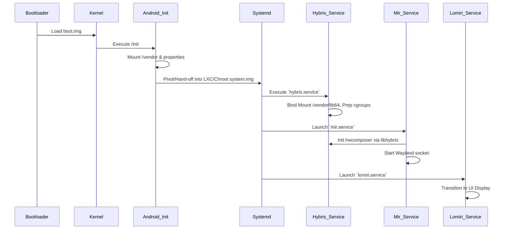

# Ubuntu Touch Treble GSI (Halium / libhybris Architecture)

This directory provides an alternative architecture for booting Ubuntu Touch on Android devices supporting Project Treble. Instead of using a pure Wayland/LXC native injection, this architecture relies on `systemd` alongside `libhybris` which traditionally links Android hardware HALs directly to the Linux graphical stack (via Halium principles).

## 🏗️ Full Architecture Diagram

```mermaid
graph TD
    subgraph HARDWARE [Android Device Hardware]
        GPU
        DISP[Display Controller]
        TOUCH[Touch Matrix]
        CAM[Camera]
        AUD[Audio DSP]
    end

    subgraph ANDROID_TREBLE [Vendor Partition (Android 9+)]
        HAL_HW[hwcomposer HAL]
        HAL_GR[gralloc HAL]
        HAL_AUD[Audio HAL]
        HAL_CAM[Camera HAL]
        DRIVERS[Kernel DRM / Input]
    end

    subgraph UBUNTU_GSI [Ubuntu GSI Partition]
        SYSTEMD[systemd (PID 1 in LXC or Native)]
        LIBH[libhybris]
        MIR[Mir Server (miral-app)]
        LOM[Lomiri Session UI]
        NM[NetworkManager]
        PA[PulseAudio / AudioFlinger]
    end

    GPU & DISP & TOUCH & CAM & AUD --- DRIVERS
    DRIVERS --- HAL_HW & HAL_GR & HAL_AUD & HAL_CAM
    HAL_HW & HAL_GR --- LIBH
    LIBH --- MIR
    MIR --- LOM
    HAL_AUD --- PA
```

## 📜 Boot Sequence 



## 📁 System / Filesystem Layout

Upon executing `mk-gsi.sh`, the final `system.img` will contain a strictly standardized Treble filesystem format:

```
system.img
├── /system          (Mountpoint for standard Android framework if combined)
├── /vendor          (Mountpoint for Vendor HALs)
├── /odm             (Mountpoint for ODM definitions)
├── /halium          (Special directory for Halium specific init hooks)
├── /lib64/android   (Symlinked Android libraries configured by hybris.service)
├── /lib64/vendor    (Symlinked Android vendor libraries)
├── /home/phablet    (Default user home directory)
├── /etc/systemd/system/ (Systemd triggers: hybris.service, mir.service, lomiri.service)
└── /usr/bin         (Lomiri, Mir, and core Linux binaries)
```

## ⚙️ Automated Build System

This environment requires **Linux/Ubuntu Host Native Compilation** due to `debootstrap` mechanics.

**Master Orchestrator:**
```bash
sudo ./build.sh
```

**Step-by-Step Execution if needed:**
1. Generate the Rootfs (creates `halium-rootfs` directory packed with packages):
   `sudo ./mk-rootfs.sh`
2. Bundle into `system.img`:
   `sudo ./mk-gsi.sh ./halium-rootfs system.img`

## 🔋 Device Support & Optimizations
- **ZRAM/ZSWAP:** `zram-tools` is installed and defaults to LZ4 allocating 50% system memory on demand to enhance low-memory devices.
- **Audio/Camera Integration:** Audio works out-of-the-box assuming the vendor HALs comply with PulseAudio/Audioflinger via `libhybris`.

## ⚡ Flashing Instructions

**Requirements:**
- Bootloader MUST be UNLOCKED.
- The device should support **fastbootd** (dynamic partitions usually default to this).

```bash
# 1. Enter Android Fastboot/Bootloader
adb reboot bootloader

# 2. Enter fastbootd if your device uses dynamic partitions
fastboot reboot fastboot

# 3. Flash the GSI target directly onto the system block
fastboot flash system system.img

# 4. Optional: wipe userdata to guarantee a clean state
fastboot wipe -w

# 5. Reboot into Lomiri automatically
fastboot reboot
```

## 🚨 Troubleshooting
- **Device Boots but UI stays black:**
    Check `systemctl status mir.service` logs via ADB shell. Your specific `hwcomposer` might be conflicting with the libhybris bridge. Ensure `/vendor/lib64` isn't missing critical EGL implementations.
- **ADB keeps saying "Offline" or not authorizing:**
    Ensure you added your fastboot/ADB public keys or adjust `android-tools-adbd` inside `/etc/init`. 
- **Permission Denied building System:**
    Ensure you execute `./build.sh` using `sudo` to mount necessary namespaces and ext4 format structures.
