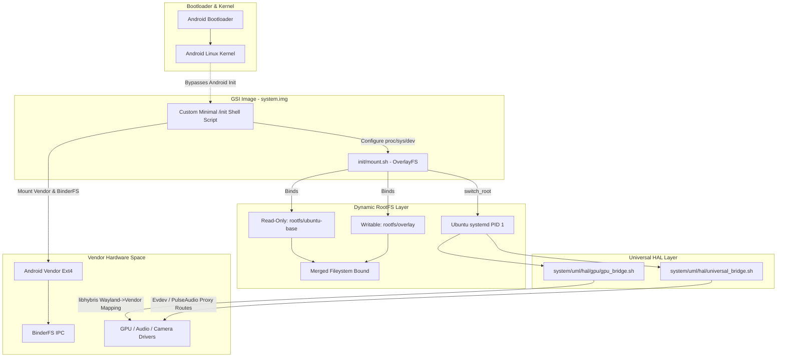

# Universal Mobile Linux Architecture (UMLA) Standalone GSI

UMLA Standalone represents the ultimate Treble-native Linux implementation. It **completely bypasses Android's `init`**, dropping a custom shell bootstrap sequence into PID 1 to orchestrate an OverlayFS Dynamic RootFS environment.

By totally untethering from Halium, Mesa (where possible), and the Android Init framework, UMLA Standalone achieves pure Linux control over vendor hardware endpoints via `libhybris`.

## 🚀 True Linux Boot Process



## 🛠 Required Features

1. **Custom Linux `/init`:** The generated `ubuntu-touch-gsi-arm64.img` does not contain Android init routines. It executes standard Unix mechanisms mapping Vendor and BinderFS boundaries manually.
2. **OverlayFS Integration:** Rather than maintaining a gigabyte-sized block device payload, the base Jammy/Noble filesystem sits read-only overlaid by a writable block allowing safe `apt update && apt upgrade` natively!
3. **Waydroid & Networking Included:** Utilizing LXC containers mapped through `udev`, Waydroid instances run seamlessly directly inside Lomiri binding cleanly to the Android HWBinder paths.

---

## 🏗 Build & Deploy Strategy

```bash
# Executing the full Image Build Pipeline
chmod +x build.sh scripts/*.sh init/*.sh system/uml/hal/*.sh system/uml/hal/gpu/*.sh
sudo ./build.sh
```

**Flashing Instructions:**
Works universally on A-only and A/B configurations assuming `CONFIG_OVERLAY_FS` is compiled natively in the bootloader kernel. Flashes directly to `system` via typical `fastboot` commands!

---

## 💖 Credits and Acknowledgements

This architecture wouldn’t be possible without phenomenal engineering from the community:
- **UBports:** Providing the Lomiri UI framework natively.
- **libhybris:** The core mechanism binding Linux glibc environments smoothly into Android bionic limits.
- **Mesa & Linux Kernel Teams:** Foundation block architectures.
- **Waydroid:** Containerizing Android logic perfectly within a Linux host.
- **Halium Community Research:** While we do not depend on Halium, their early mappings provided deep insight into Hardware orchestration over GNU variants.

> "Inspiration for the Ubuntu Touch Treble GSI concept was partially derived from community discussions: 
> https://xdaforums.com/t/gsi-arm64-a-ab-ubuntu-touch-ubports.4110581/"
