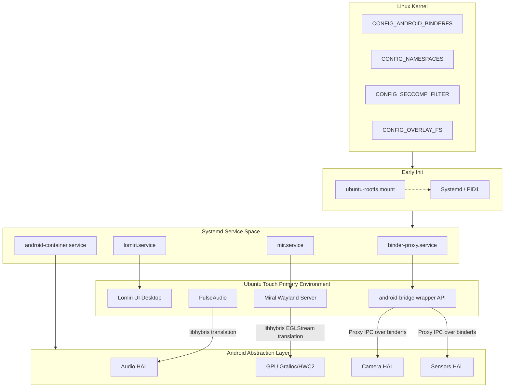

# Universal Next Ubuntu Touch GSI (Android 15-18+)

This repository houses the **Universal Next Architecture** designed to deploy Ubuntu Touch (Lomiri UI) natively over high-end Android smartphones compliant with Treble architecture while guaranteeing forward-compatibility toward future Android versions and Android Virtualization Framework (AVF) mechanisms.

## 🚀 Concept & Architecture

This implementation completely uncouples the Ubuntu Base OS from legacy `system_server` mappings and insecure `hwbinder`/`hwservicemanager` proxy layers. Instead, it places the primary Ubuntu host inside an absolute `binderfs` mapping isolating legacy vendor layers securely behind `LXC` containment structures and a dedicated `android-bridge` mapping space. 

This ensures if Vendor HAL APIs skew over Android 16-18, the Ubuntu runtime stays uninterrupted.

### Architectural Diagram



### Core Features:
- **AVF Ready Android-Bridge (`/system/android-bridge`):** A strictly categorized API path ready to scale the Wayland, Input, and Pulse wrappers indefinitely past SDK 35 changes.
- **Binder-only Protocol:** Strict implementation utilizing ONLY `binderfs` mounts (`/dev/binder` mapped natively proxy checking inputs, rejecting legacy calls). Optional components (camera/sensors) degrade gracefully.
- **EGL Wayland Bridge Overlay:** Translates Wayland rendering exclusively to Mesa EGL scaling down to the local Android EGL hooks. Support extends uniformly across Adreno, Mali, and PowerVR pipelines dynamically bridging native hardware composer endpoints (`HWC2`).

---

## 📜 Build Instructions

The script handles generating the structural mapping directly from source fetching submodules, and natively packaging sparse Treble architectures out of custom overlays.

```bash
# Provide execution privileges to orchestrator logic
chmod +x build.sh rootfs-builder.sh gsi-pack.sh

# Trigger Full Compilation (requires sudo)
sudo ./build.sh
```

**Output:** `ubuntu-touch-gsi-arm64.img` (Target dynamic map block image).

--- 

## ⚡ Target Flashing

**Requirements:**
- Bootloader MUST be UNLOCKED.
- Fastbootd partition access (Dynamic partitions).
- Android Treble (A/B Structure).

```bash
# Boot into Bootloader Fastboot abstraction layer
adb reboot bootloader

# Switch to standard Userspace Fastboot 
fastboot reboot fastboot

# Dispatch payload over dynamic partition configurations
fastboot flash system ubuntu-touch-gsi-arm64.img

# Format userdata guarantees a fresh state
fastboot wipe -w

# Boot into Lomiri UI (Android UI completely purged)
fastboot reboot
```

---

## 💖 Community Credits & Acknowledgement

> "Inspiration for the Ubuntu Touch Treble GSI concept was partially derived from community discussions: 
> https://xdaforums.com/t/gsi-arm64-a-ab-ubuntu-touch-ubports.4110581/"

The massive scaling logic of Ubuntu Core, libhybris proxy handlers, and LXC virtualization logic heavily depend upon standard open systems pioneered by UBports, MirServer, and Canonical respectively. By bridging them natively together, we eliminate the previous fragmentation inherently preventing reliable daily GSI booting.
